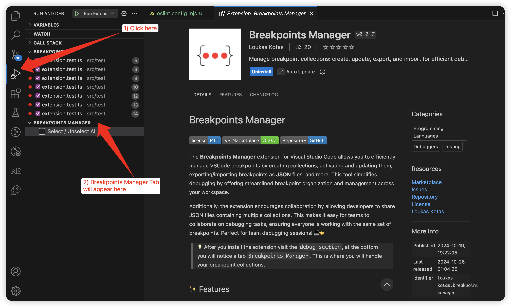
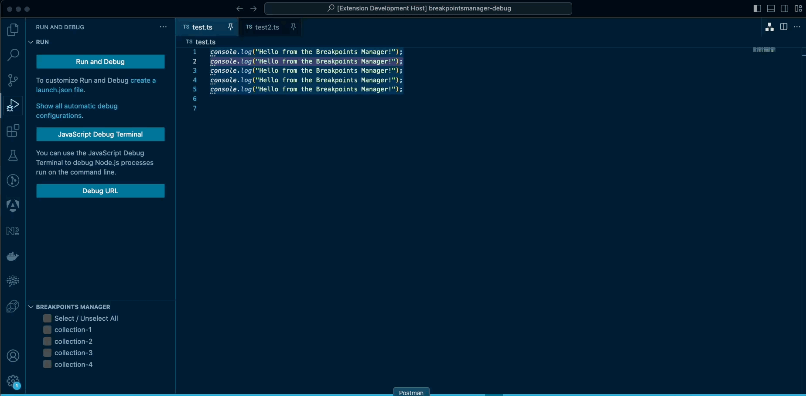

# Breakpoints Manager

<!-- Add later -->
<!--  -->
<!--  -->

The **Breakpoints Manager** extension for Visual Studio Code allows you to efficiently manage VSCode breakpoints by creating collections, activating and updating them, exporting/importing breakpoints as **JSON** files, and more. This tool simplifies debugging by offering streamlined breakpoint organization and management across your workspace.

Additionally, the extension encourages collaboration by allowing developers to share JSON files containing multiple collections. This makes it easy for teams to collaborate on debugging tasks, ensuring everyone is working with the same set of breakpoints. Perfect for team debugging sessions! 💻🤝

>💡 After you install the extension visit the `debug section`, at the bottom you will notice a tab `Breakpoints Manager`. This is where you will handle your breakpoint collections.

 
  

 

## ✨ Features

&nbsp;&nbsp;&nbsp;🔖 **Create Collections**: Organize breakpoints into collections for easier management.

&nbsp;&nbsp;&nbsp;⚡ **Activate Collection**: Quickly activate a collection of breakpoints.

&nbsp;&nbsp;&nbsp;🔄 **Update Collection**: Modify breakpoints within a collection and update them without needing to recreate.

&nbsp;&nbsp;&nbsp;📤 **Export Collections**: Save your collections as JSON files to reuse or share.

&nbsp;&nbsp;&nbsp;📥 **Import Collections**: Import previously saved collections for quick access.

&nbsp;&nbsp;&nbsp;✅ **Select All Collections**: Easily select and manage multiple collections at once.

&nbsp;&nbsp;&nbsp;🔍 **Search Collections**: Quickly find a specific collection by name.

&nbsp;&nbsp;&nbsp;🗑️ **Delete Collections**: Remove unwanted collections from the manager.

 

## 🛠️ Requirements

No special requirements or dependencies. Just install and start managing your breakpoints!

 

## 📸 Feature Demos

Here are demonstrations of how each feature works:

### **Create Collections**  
  

### **Activate Collection**  
  

### **Update Collection**  
  

### **Export Collections**  
  

### **Import Collections**  
  

### **Search Collection**  
  

### **Delete Collections**
  

 

## ⚠️ Known Issues

- Importing too many collections at once may slow down the UI.
- Breakpoints outside the current workspace may not be fully supported.

 

## Bug Reports & Feature Requests

If you encounter any issues or have ideas for new features, feel free to contribute by opening a:

- 🐛 [Bug Report](https://github.com/loukas-kotas/breakpoints-manager/issues/new?assignees=&labels=bug&template=bug_report.md&title=)
- ✨ [Feature Request](https://github.com/loukas-kotas/breakpoints-manager/issues/new?assignees=&labels=enhancement&template=feature_request.md&title=)

 

### **Enjoy Debugging!**
